# NEXUS Architecture - One-Page Visual

## System Overview (High-Level)

---

## The Three Layers (Detailed)

```mermaid
flowchart TB
    subgraph LAYER1["🔄 Layer 1: Federated APIs (Synchronous)"]
        direction LR
        API1[SMART-on-FHIR R4+]
        API2[OAuth 2.0 / OIDC]
        API3[mTLS Security]
        API1 ~~~ API2 ~~~ API3
    end
    
    subgraph LAYER2["📡 Layer 2: Event-Driven Mesh (Asynchronous)"]
        direction LR
        E1[Kafka / EventBridge]
        E2[MCP Routing]
        E3[Store & Forward]
        E1 ~~~ E2 ~~~ E3
    end
    
    subgraph LAYER3["🔒 Layer 3: Signed Audit Ledger (Immutable)"]
        direction LR
        L1[QLDB / Confidential Ledger]
        L2[Cryptographic Signatures]
        L3[Merkle Trees]
        L4[Optional Blockchain]
        L1 ~~~ L2 ~~~ L3 ~~~ L4
    end
    
    LAYER1 -.->|Real-time queries| DATA[(Data Sources)]
    LAYER2 -.->|Event notifications| DATA
    DATA -.->|All actions logged| LAYER3
    
    style LAYER1 fill:#e3f2fd
    style LAYER2 fill:#fff3e0
    style LAYER3 fill:#f3e5f5
```

---

## Data Flow (Request to Response)

---

## Observer AI - Continuous Monitoring

---

## Multi-Stakeholder Coordination

---

## Consent Management

```mermaid
stateDiagram-v2
    [*] --> NoConsent: Initial State
    NoConsent --> Requested: Patient action
    Requested --> Reviewing: Patient reviews
    Reviewing --> Approved: Patient signs
    Reviewing --> Denied: Patient declines
    Approved --> Active: Token issued
    Active --> Active: Queries allowed
    Active --> Revoked: Patient revokes
    Active --> Expired: Time limit
    Denied --> [*]
    Revoked --> [*]
    Expired --> [*]
    
    note right of Active
        Consent token includes:
        • Who can access
        • What data
        • For what purpose
        • Until when
    end note
```

---

## Technology Stack

---

## Deployment Architecture (Pitt-Anthropic)

---

## Value Proposition

---

**These visuals are perfect for:**
- GitHub README.md (main page)
- Presentation slides
- Documentation
- Grant proposals
- Investor pitches

**All diagrams render automatically on GitHub!** 🎨
