# NEXUS Health Mesh - Process Map Visuals

This document contains all process flow diagrams for the NEXUS Health Mesh architecture.

**Format**: Mermaid diagrams (render automatically on GitHub)

---

## 1. Overall System Architecture


---

## 2. Care Transition Workflow (Hospital to Hospital)


---

## 3. Observer AI Detection & Escalation


---

## 4. Consent Token Flow


---

## 5. Multi-Stakeholder Coordination (Cancer Treatment)


---

## 6. Event-Driven Mesh Architecture


---

## 7. Insurance Authorization Flow

```mermaid
sequenceDiagram
    participant D as Doctor
    participant EHR as Hospital EHR
    participant AI as NEXUS AI
    participant INS as Insurance AI
    participant OBS as Observer
    
    D->>EHR: Order MRI for patient
    EHR->>AI: Event: auth.request.created
    
    AI->>INS: Authorization request:<br/>• Diagnosis: L4-L5 radiculopathy<br/>• Prior treatment: PT x 8 weeks<br/>• Clinical notes: Pain 8/10
    
    INS->>INS: Check policy:<br/>• MRI requires failed PT<br/>• PT duration: 6 weeks min
    
    alt Approval Path
        INS->>AI: APPROVED<br/>Ref: AUTH-789123
        AI->>EHR: Update: Authorized
        AI->>D: Notify: MRI approved
        EHR->>EHR: Schedule MRI
    else Denial Path
        INS->>AI: DENIED<br/>Reason: Try X-ray first<br/>Appeal info attached
        AI->>EHR: Update: Denied
        AI->>D: Notify: Denied + appeal option
        
        D->>AI: Appeal with:<br/>• ACR guidelines<br/>• Contraindication to X-ray<br/>• Clinical urgency
        
        AI->>INS: Appeal submission
        INS->>INS: Peer review
        INS->>AI: APPROVED on appeal
        AI->>EHR: Update: Approved
    end
    
    AI->>OBS: Log decision path
    OBS->>OBS: Monitor:<br/>• Time to decision<br/>• Appropriateness<br/>• Pattern detection
    
    alt Concern Detected
        OBS->>AI: Alert: Multiple denials<br/>for similar cases
        AI->>D: Notify: Pattern detected<br/>Consider policy discussion
    end
    
    rect rgb(200, 255, 200)
        Note over AI,OBS: All logged to audit ledger
    end
```



---

## 8. Federated Learning Network


---

## 9. Patient AI Companion Interaction


---

## 10. Three-Layer Mesh - Data Flow


---

## How to Use These Diagrams

### **1. Add to GitHub Repository**

Create a new file: `docs/process-maps.md` and paste this content.

GitHub will automatically render Mermaid diagrams!

### **2. Add to README**

Add a link in your main README.md:
```markdown
## 📊 Process Maps & Architecture Diagrams

See detailed visual workflows: [Process Maps](docs/process-maps.md)
```

### **3. Reference in Documentation**

Link to specific diagrams:
```markdown
See the [Care Transition Workflow](docs/process-maps.md#2-care-transition-workflow-hospital-to-hospital)
```

### **4. Use in Presentations**

Take screenshots of rendered diagrams for PowerPoint/Google Slides.

### **5. Export as Images**

Use tools like:
- https://mermaid.live (paste diagram, export as PNG/SVG)
- GitHub's rendered view (screenshot)
- VS Code with Mermaid extension

---

## Diagram Legend

| Color | Meaning |
|-------|---------|
| Light Blue | User/Patient |
| Light Red | Events/Async |
| Light Green | AI/Processing |
| Light Purple | Audit/Ledger |
| Light Yellow | External Systems |
| Red | Urgent/Critical |
| Orange | Warning/Medium |
| Yellow | Notice/Low |
| Green | Success/Learning |

---

**These diagrams are ready to use in your Pitt-Anthropic submission!** 🎨

*Created: November 18, 2025*
