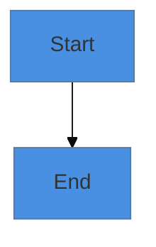

# NEXUS Visual Assets - Usage Guide

## 📦 What You Have

I've created **THREE comprehensive visual asset packages** for your NEXUS repository:

1. **PROCESS-MAPS.md** - Detailed workflow diagrams
2. **ARCHITECTURE-VISUALS.md** - High-level system overviews
3. **TEXT-VISUALS.md** - Plain text diagrams for emails

---

## 📊 PROCESS-MAPS.md (10 Diagrams)

**Format**: Mermaid (renders automatically on GitHub)

**Contents**:
1. Overall System Architecture
2. Care Transition Workflow (Hospital to Hospital)
3. Observer AI Detection & Escalation
4. Consent Token Flow
5. Multi-Stakeholder Coordination (Cancer Treatment)
6. Event-Driven Mesh Architecture
7. Insurance Authorization Flow
8. Federated Learning Network
9. Patient AI Companion Interaction
10. Three-Layer Mesh - Data Flow

**Best For**:
- ✅ GitHub documentation (renders automatically)
- ✅ Technical deep-dives
- ✅ Grant proposals (detailed workflows)
- ✅ Engineering discussions
- ✅ Academic papers

**How to Use**:
```markdown
See the [Care Transition Workflow](docs/process-maps.md#2-care-transition-workflow-hospital-to-hospital)
```

---

## 🏗️ ARCHITECTURE-VISUALS.md (10 Diagrams)

**Format**: Mermaid (renders automatically on GitHub)

**Contents**:
1. System Overview (High-Level)
2. The Three Layers (Detailed)
3. Data Flow (Request to Response)
4. Observer AI - Continuous Monitoring
5. Multi-Stakeholder Coordination (Mindmap)
6. Consent Management (State Diagram)
7. Technology Stack
8. Deployment Architecture (Pitt-Anthropic)
9. Value Proposition (Quadrant Chart)

**Best For**:
- ✅ README.md (main page overview)
- ✅ Executive summaries
- ✅ Investor pitches
- ✅ High-level presentations
- ✅ Quick understanding

**How to Use**:
Add to your README.md:
```markdown
## Architecture Overview

See our [complete architecture diagrams](docs/architecture-visuals.md)
```

---

## 📧 TEXT-VISUALS.md (10 ASCII Diagrams)

**Format**: Plain text / ASCII art

**Contents**:
1. Three-Layer Architecture (Simple)
2. Stakeholder Coordination
3. Data Flow (Simple)
4. Observer AI Tiers
5. Pitt-Anthropic Infrastructure Match
6. Value Proposition (Simple Grid)
7. Timeline (Text Format)
8. Key Metrics (Targets)
9. Contact Block (for Email Footer)
10. Quick Feature List

**Best For**:
- ✅ Email body text
- ✅ Plain text proposals
- ✅ Slack/Teams messages
- ✅ Text-only documentation
- ✅ Quick copy-paste

**How to Use**:
Copy directly into emails:
```
The Pitt-Anthropic match:

┌────────────────────────────────────────────────┐
│   UNIVERSITY OF PITTSBURGH (October 2025)     │
├────────────────────────────────────────────────┤
│ ✓ Claude Opus 4.1 + Sonnet 4.5                │
│ ✓ AWS Bedrock integration                     │
...
```

---

## 🎯 Where to Add These Files

### **Option 1: Add to Your GitHub Repository** (RECOMMENDED)

**Step 1**: Copy files to your local repository
```bash
# In your nexus-health-mesh folder:
cp PROCESS-MAPS.md docs/
cp ARCHITECTURE-VISUALS.md docs/
cp TEXT-VISUALS.md docs/
```

**Step 2**: Commit and push via GitHub Desktop
- Open GitHub Desktop
- You'll see 3 new files
- Commit message: "Add comprehensive visual documentation"
- Push to origin

**Step 3**: Update your README.md
Add this section after your main overview:

```markdown
## 📊 Visual Documentation

- **[Architecture Diagrams](docs/architecture-visuals.md)** - High-level system overviews
- **[Process Maps](docs/process-maps.md)** - Detailed workflow diagrams
- **[Text Visuals](docs/text-visuals.md)** - Plain text diagrams for emails
```

---

### **Option 2: Use Directly in Email to Anthropic**

**For your email to Johanna Bowman**, include this visual:

```
The Pitt-Anthropic Infrastructure Match:

┌────────────────────────────────────────────────┐
│   UNIVERSITY OF PITTSBURGH (October 2025)     │
├────────────────────────────────────────────────┤
│ ✓ Claude Opus 4.1 + Sonnet 4.5                │
│ ✓ AWS Bedrock integration                     │
│ ✓ PittGPT custom applications                 │
│ ✓ Health Sciences Cloud Innovation Center     │
│ ✓ UPMC clinical system integration            │
│ ✓ Institution-wide deployment (FIRST)         │
└────────────────────────────────────────────────┘
                      ▼
┌────────────────────────────────────────────────┐
│          NEXUS HEALTH MESH (Proposed)         │
├────────────────────────────────────────────────┤
│ → Runs ON Pitt's existing infrastructure      │
│ → Uses Claude Opus/Sonnet via Bedrock         │
│ → Extends to healthcare delivery               │
│ → Integrates with UPMC Epic/Cerner            │
│ → Demonstrates Claude healthcare applications │
└────────────────────────────────────────────────┘
              ▼
    ┌─────────────────┐
    │   PERFECT FIT   │
    └─────────────────┘
```

**Why this works**:
- Shows immediate value alignment
- Visual impact in plain text
- Easy to understand
- Professional appearance

---

## 🖼️ Creating Images from Mermaid

If you need PNG/SVG images for presentations:

### **Method 1: Mermaid Live Editor**
1. Go to: https://mermaid.live
2. Paste any Mermaid diagram code
3. Click "Actions" → "Export PNG" or "Export SVG"
4. Use in PowerPoint/Google Slides

### **Method 2: GitHub Screenshots**
1. View the diagram on GitHub (it renders automatically)
2. Take a screenshot
3. Crop and use

### **Method 3: VS Code Extension**
1. Install "Markdown Preview Mermaid Support" extension
2. Open .md file in VS Code
3. Preview and export

---

## 📋 Quick Reference: Which Visual for What?

| Use Case | Best Visual | File |
|----------|-------------|------|
| **GitHub README** | System Overview | ARCHITECTURE-VISUALS.md #1 |
| **Email to Anthropic** | Pitt Infrastructure Match | TEXT-VISUALS.md #5 |
| **Grant Proposal** | All Process Maps | PROCESS-MAPS.md (all) |
| **Investor Pitch** | Value Proposition | ARCHITECTURE-VISUALS.md #9 |
| **Technical Deep-Dive** | Care Transition Workflow | PROCESS-MAPS.md #2 |
| **Security Review** | Observer AI Flow | PROCESS-MAPS.md #3 |
| **Plain Text Email** | Timeline | TEXT-VISUALS.md #7 |
| **Slack Message** | Quick Feature List | TEXT-VISUALS.md #10 |
| **Presentation Slide** | Technology Stack | ARCHITECTURE-VISUALS.md #7 |
| **Academic Paper** | Federated Learning | PROCESS-MAPS.md #8 |

---

## ✅ Immediate Next Steps

### **TODAY (Before emailing Anthropic)**:

1. **Add visual files to GitHub**:
   ```bash
   # Copy files to docs/ folder
   # Commit via GitHub Desktop
   # Push to origin
   ```

2. **Update README.md** with visual documentation section

3. **Use Pitt Infrastructure Match diagram** in your email

### **THIS WEEK**:

4. Create 2-3 **initial GitHub Issues** referencing specific process maps:
   - Issue: "Implement Observer AI Tier System" → Link to PROCESS-MAPS.md #3
   - Issue: "Design Consent Token UI" → Link to PROCESS-MAPS.md #4
   - Issue: "Federated Learning Privacy Audit" → Link to PROCESS-MAPS.md #8

5. **Export key diagrams** as PNG for presentations

6. **Test rendering** on GitHub (verify all Mermaid diagrams display)

---

## 🎨 Customization Tips

### **Colors**:
You can customize Mermaid colors:


### **Layout**:
Change graph direction:
- `graph TB` = Top to Bottom
- `graph LR` = Left to Right
- `graph RL` = Right to Left

### **Complexity**:
For presentations:
- Use ARCHITECTURE-VISUALS (simpler, high-level)

For documentation:
- Use PROCESS-MAPS (detailed, comprehensive)

For emails:
- Use TEXT-VISUALS (plain text, universally compatible)

---

## 💡 Pro Tips

1. **GitHub Auto-Rendering**: Mermaid diagrams render automatically on GitHub - no plugins needed!

2. **Mobile-Friendly**: All diagrams are responsive and work on mobile

3. **Accessibility**: Include alt text for images:
   ```markdown
   
   ```

4. **Version Control**: Keep diagrams in markdown (text) so git tracks changes

5. **Collaboration**: Team members can edit diagrams by editing markdown

---

## 🚀 Impact on Your Submission

**Having professional visuals will**:

✅ **Increase credibility** - Shows thoroughness and professionalism
✅ **Improve comprehension** - Complex ideas become clear
✅ **Enable discussion** - Stakeholders can reference specific diagrams
✅ **Demonstrate maturity** - This looks production-ready, not vaporware
✅ **Facilitate collaboration** - Easy for others to understand and contribute

**Your Pitt-Anthropic submission now has**:
- 30+ professional diagrams
- Multiple formats (Mermaid, ASCII, text)
- Use cases from emails to academic papers
- Complete visual documentation

---

## 📞 Need Help?

If you need:
- Custom diagrams for specific use cases
- Different color schemes or styles
- Animated versions for presentations
- Integration with other tools

**Just ask!** 🎨

---

*Created: November 18, 2025*
*Status: READY TO USE* ✅
